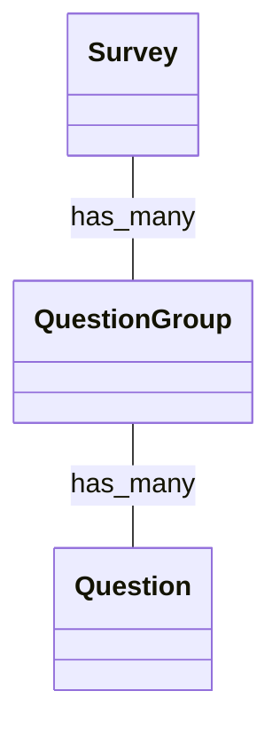
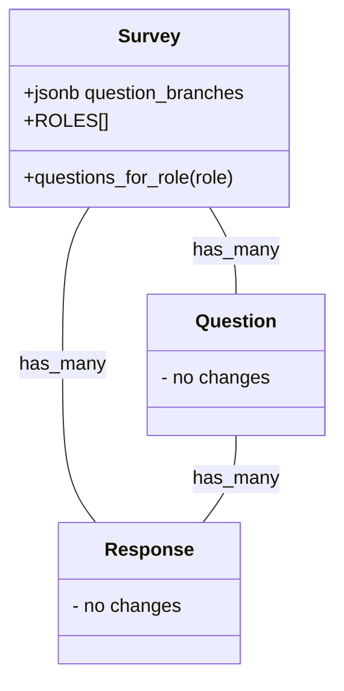

# Jarrett's thoughts

This could have gone a number of different ways. My first inclination was to think about creating a true tree  structure in the database - this would allow for real branching down the line of the survey, not just at the root. Future proof, but introduces complexity out of the gate that might not actually be used. 

After talking to Abi, the reqs only required root branching. No need for a tree structure. 

So maybe a wrapper model:

Ultimately, this seems like a front-end concern if anything, so creating new models, relationships, tables, etc doing it 'the rails way', also seemed overkill. 

So, without trying to play code golf, I settled on this bare-bones approach. It only adds one new column, one method, and an array of roles and is super easy to reason about. Roles could be more malleable if needed and persisted on each Survey, but I went with the assumption that they don't change. 

